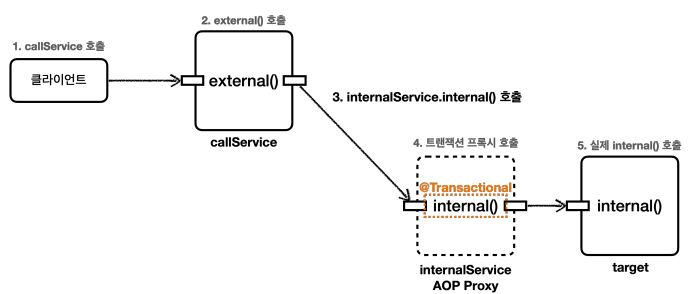

# 인프런 강의 : 스프링 DB 2편 - 데이터 접근 활용기술 (part2.트랜잭션)
- 그룹 : spring-db
---
## 스프링 트랜잭션
- 트랜잭션 추상화, 스프링 부트의 자동 주입
    - DB 기술에 따라 트랜잭션을 사용하는 코드가 모두 달랐다.
    - 기술 변경 시 코드 변경을 최소화 하기 위해서 스프링은 트랜잭션 추상화를 통해 이를 해결했다 -> `PlatformTransactionManager`
      ```java
      public interface PlatformTransactionManager extends TransactionManager {
          getTransaction(@Nullable TransactionDefinition definition) throws TransactionException;
        
          void commit(TransactionStatus status) throws TransactionException;
        
          void rollback(TransactionStatus status) throws TransactionException;
      }
      ```
    - 또한 스프링은 트랜잭션 매니저의 구현체도 제공하기 때문에 필요한 구현체를 스프링 빈으로 등록하고 주입 받아 사용만 하면 된다.
    - 스프링부트는 어떤 데이터 접근 기술을 사용하는지를 자동으로 인식해서 적절한 트랜잭션 매니저를 선택해서 빈으로 등록해준다.
- 선언적 트랜잭션과 AOP
    - 트랜잭션을 처리하기 위한 프록시를 도입하기 전에는 서비스 로직에서 트랜잭션을 직접 시작했다.

### 스프링 트랜잭션 적용 확인
- @Transaction 이 특정 클래스나 메서드에 하나라도 있으면 트랜잭션 AOP는 프록시를 만들어서 스프링 컨테이너에 등록한다.
- 그리고 프록시는 내부에 실제 객체를 참조하게 된다. 
- ` TransactionSynchronizationManager.isActualTransactionActive()` 
  - 현재 쓰레드에 트랜잭션이 적용되어 있는지 확인할 수 있는 기능 

### 트랜잭션 적용 위치에 따른 우선순위 
- 항상 더 구체적이고 자세한 것이 높은 우선순위를 가진다.
  - 메서드 -> 클래스 -> 인터페이스 
- TxLevelTest.class

## 트랜잭션 AOP가 작동 하지 않아 트랜잭션이 시작하지 않는 경우 
### 01. 프록시와 메서드 내부 호출
- `@Transaction`을 사용하면 스프링의 트랜잭션 AOP가 적용되며 프록시 방식을 사용한다.
- 대상 객체의 내부에서 메서드 호출이 발생하면 프록시를 거치지 않고 대상 객체를 직접 호출하는 문제가 발생한다. 그럼 트랜잭션이 적용되지 않는다.
  ```java
  @Slf4j
  @SpringBootTest
  public class InternalCallV1Test {
  
  @Autowired CallService callService;

    @Test
    void printProxy() {
        log.info("callService class = {}", callService.getClass());
    }
    @Test
    void internalCall() {
         callService.internal();
    }
    @Test
    void externalCall() {
        callService.external();
    }

    @TestConfiguration
    static class IntervalCallV1TestConfig {
        @Bean
        CallService callService() {
            return new CallService();
        }
    }

    @Slf4j
    static class CallService {

        public void external() {
            log.info("call external");
            printTxInfo();
            //===== 아래 코드 부터만 트랜잭션이 필요해서 분리한 상황 (의도는 그렇다. 실제론 트랜잭션 작동 안함)
            internal();
        }
        @Transactional
        public void internal() {
            log.info("call internal");
            printTxInfo();
        }

        private void printTxInfo() {
            boolean txActive = TransactionSynchronizationManager.isActualTransactionActive();
            log.info("tx active = {} ", txActive);
            boolean readOnly = TransactionSynchronizationManager.isCurrentTransactionReadOnly();
            log.info("tx read = {}", readOnly);
        }
    }
   }
  ```
- 문제원인
  -  
  - 자바 언어에서 메서드 앞에 별도의 참조가 없으면 this라는 뜻으로 자기 자신의 인스턴스를 가리킨다.
- 해결 
  - 이를 보완하기 위해 트랜잭션을 사용해야 하는 메서드를 별도의 클래스로 분리하는 방법이 있을 수 있다.
  ```java
  @Slf4j
  @SpringBootTest
  public class InternalCallV2Test {
    @Autowired CallService callService;

    @Test
    void externalCall() {
        callService.external();
    }

    @TestConfiguration
    static class IntervalCallV2TestConfig {
        @Bean
        CallService callService() {
            return new CallService(innerService());
        }
        @Bean
        InternalService innerService() {
            return new InternalService();
        }
    }

    @Slf4j
    @RequiredArgsConstructor
    static class CallService {
        private final InternalService internalService;
        public void external() {
            log.info("call external");
            printTxInfo();
            internalService.internal();
        }

        private void printTxInfo() {
            boolean txActive = TransactionSynchronizationManager.isActualTransactionActive();
            log.info("tx active = {} ", txActive);
        }
    }

    @Slf4j
    static class InternalService {
        @Transactional
        public void internal() {
            log.info("call internal");
            printTxInfo();

        }
        private void printTxInfo() {
            boolean txActive = TransactionSynchronizationManager.isActualTransactionActive();
            log.info("tx active = {} ", txActive);
        }
    }
  }
  ```
  - 
### 02. public 메서드에만 트랜잭션이 적용됨
- 스프링의 트랜잭션 AOP 기능은 `public` 메서드에서만 트랜잭션을 적용하도록 기본설정 되어 있다.
- 트랜잭션은 주로 비즈니스 로직의 시작점에 걸기 때문에 대부분 외부에 열어준 곳을 시작점으로 사용한다. 
- 이런 이유로 이런 규칙이 만들어 졌다. 

### 03. 초기화 시점
- 스프링 초기화 시점에는 트랜잭션 AOP가 적용되지 않을 수 있다. 
- 초기화 코드가 먼저 호출되고, 그 다음에 트랜잭션 AOP가 적용되기 때문이다. 
- 해결 방법으로 `@PostConstruct` 보다는 `@EventListener(ApplicationReadyEvent.class)`을 사용하는 것이다. (트랜잭션이 필요하다면)
```java
    static class Hello{
        @PostConstruct
        @Transactional
        public void initV1() {
            boolean isActive = TransactionSynchronizationManager.isActualTransactionActive();
            log.info("Hello init @PostConstruct tc active = {}", isActive);
        }
        @EventListener(ApplicationReadyEvent.class)
        @Transactional
        public void initV2() {
            log.info("");
        }
    }
```